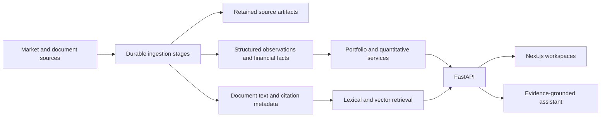

# RAAHIM — PSX Portfolio Workstation

RAAHIM brings Pakistan Stock Exchange research and portfolio analysis into one workspace. It connects sourced market observations and company documents with an investor's recorded holdings, cash and portfolio-specific objectives. An AI assistant can explain that evidence, while deterministic services perform valuation, risk calculations, optimization and scenario analysis.

The product is a **decision-support workstation**. It does not place trades, connect through broker passwords or treat model-generated text as verified financial data.

## The product

### Understand the market

The **Today** view combines market conditions, portfolio performance, material events and macro context. **Markets** provides a searchable PSX universe, sector comparisons, prices and index history. Company workspaces bring together technical charts, stored financial facts, reports, events and optional relevance to a selected portfolio.

Prices and classifications retain source and observation metadata. Missing, incomplete and stale coverage stays visible rather than being filled with model estimates.

### Manage portfolios with a mandate

Each portfolio has its own **Investment Policy Statement (IPS)**: objectives, horizon, liquidity needs, risk assessment, benchmark and constraints. The globally selected portfolio supplies context when a request does not explicitly select another one.

Portfolio records include holdings, transactions and cash. Valuation and PnL use stored positions and market prices; performance accounts for recorded cash flows and incomplete history. Allocation proposals remain separate from the holdings ledger.

The portfolio workspace includes:

- **Overview:** valuation, performance, holdings and mandate status.
- **IPS:** draft, confirm and review the portfolio's versioned mandate.
- **Build:** prepare and compare allocation proposals.
- **Quant:** frontier comparisons, modeled returns, risk contributions, correlation, CAPM and distribution views when their required inputs are available.
- **Risk:** concentration, systematic and tail risk, diversification and mandate checks.
- **Scenarios:** deterministic shocks and historical replay against stored holdings and prices.
- **Research and activity:** portfolio-relevant evidence and recorded actions.

### Research with traceable evidence

Research combines retained company reports, announcements, news and classified events. Users can upload documents, search their text and inspect original passages with source, date and page references. Company intelligence is distinct from portfolio-specific fit: a selected portfolio and its IPS are required for the latter.

Document retrieval supports narrative claims. Exact prices, amounts, rankings and portfolio values come from structured database queries.

### Ask, review and monitor

The **Assistant** supports saved conversations, streaming responses and explicit company/portfolio context. Its bounded tool loop queries application services and retrieves evidence; factual answers retain citations, freshness qualifications and missing-data states. Recommendations and allocation explanations do not execute transactions.

**Monitoring** brings together configured rules, alerts and saved recommendation reviews. **Settings** manages application preferences, notifications and supported LLM providers. User keys are encrypted at rest and decrypted only server-side immediately before provider calls.

## Technology and implementation

| Area | Technology | Role in the application |
|---|---|---|
| Web application | Next.js App Router, React, TypeScript | Routed workspaces, shared navigation, forms, browser state and typed API access. |
| Interface and charts | Tailwind CSS, CSS modules, ECharts | Responsive layouts, company technical charts and quantitative visualizations. |
| API | FastAPI, Pydantic, Uvicorn | Authenticated endpoints, input validation and structured response contracts. |
| Persistence | PostgreSQL, SQLAlchemy, Alembic | User-owned records, canonical observations, source metadata, durable job state and schema evolution. SQLite supports isolated tests and local development. |
| Retrieval | pgvector, PostgreSQL lexical indexes, Sentence Transformers | Semantic and lexical searches over document text. Structured numerical values do not come from vector search. |
| Background execution | Celery, Redis, database outbox/leases | Bounded stage dispatch, retries, priorities and worker recovery. The database retains pending work even if broker messages are lost. |
| Source artifacts | S3-compatible storage/MinIO, SHA-256 identities | Retained source captures and provenance linking observations, documents and extracted evidence to their originals. |
| Quantitative analysis | NumPy, pandas, SciPy, CVXPY | Deterministic numerical analysis, optimization and feasibility checks. Methods expose input requirements and unavailable states. |
| Provider transport | HTTPX and provider-specific adapters | OpenAI, Anthropic, Gemini, OpenRouter and Z.ai transport, streaming/tool handling and token accounting. The assistant uses an explicit tool loop, not a hidden trading agent. |
| Security | JWT authentication, bcrypt, cryptography/Fernet | Account authentication, password hashing, encrypted LLM credentials and encrypted assistant execution payloads. |
| Verification | pytest, Vitest, Playwright | Backend correctness/security tests, web behavior tests, and browser checks across desktop and mobile layouts. |

Generated OpenAPI TypeScript contracts connect the backend response schemas to the frontend. Application services separate portfolio accounting, structured market evidence, document retrieval and model orchestration.

## Data ingestion and execution

The unified ingestion pipeline uses durable stage-run records, bounded payloads, source policies and explicit live/historical modes. Different worker queues isolate discovery, fetching, parsing, heavy document work, numerical processing and intelligence refresh. Macro ingestion and saved research generation have dedicated execution paths; deployment profiles control which processes run.



Reports, prices and source text have different validation rules. A narrative amount is not promoted to a financial fact merely because it appeared in a document or model answer. Raw captures, source identities and availability states remain part of the evidence trail.

## Read performance and caching

The frontend deduplicates concurrent GET requests and caches responses briefly. Quantitative services reuse aligned market inputs. AI briefs are persisted by input hash, so unchanged evidence reuses a saved result rather than generating it again.

Public market-session selection has a short, bounded cache to avoid repeating the same historical aggregation for every widget. Numerical rows still come from database reads. Brief polling reads the existing pending generation; it does not rebuild the full fact package on every poll. Model waits do not hold database connections, and in-flight generation is scoped to its owner.

Cached content retains its source/as-of information. A cache is not a replacement for ownership, citation or freshness checks.

## Boundaries and limitations

- No trade execution or password-based broker automation.
- Portfolio, holding and transaction operations enforce ownership.
- LLM keys are never returned in full to the frontend after saving.
- Mock market data and hypothetical demo portfolios are explicitly development/demo data.
- Quantitative estimates are modeled outputs, not promised returns. Missing required inputs remain unavailable.
- Provider availability, source coverage, extraction quality and observed freshness constrain the analysis.

## Run locally

Use Python 3.13+ and Node.js 20.9+. The production images use Python 3.13 and Node.js 22.

```bash
cd apps/api
python3 -m venv .venv
source .venv/bin/activate
pip install -r requirements-dev.txt
cp ../../.env.example .env
python -m app.core.keys
alembic upgrade head
uvicorn app.main:app --reload
```

In a second terminal:

```bash
cd apps/web
npm ci
npm run dev
```

The default local Compose file provides PostgreSQL and Redis. Use it only when intentionally creating local development services. Oracle deployments use `compose.oracle.yml`. See [setup](docs/setup.md) for database, source, demo and provider configuration, and [Oracle deployment](docs/oracle-deployment.md) for private access and worker operation.

Sign-in is at `/login`; the retired onboarding route redirects there. Set the investment mandate inside a portfolio's IPS. The web app uses a same-origin `/api` proxy; configure `API_INTERNAL_BASE_URL` for a different backend location.

## Verification and schema history

```bash
cd apps/api && .venv/bin/python -m pytest -q
cd ../web
npm run typecheck
npm test -- --maxWorkers=2
npm run build
npm run test:e2e
```

Tests isolate their database/provider calls; browser suites use offline API fixtures. Regenerate frontend contracts with `npm run generate:api` when the API is running.

The active Alembic history is a frozen baseline retaining revision `0039_ai_briefs`. Older databases must finish the original chain before using it; never stamp an older schema to skip data transformations. Read the [baseline transition and verification guide](apps/api/alembic/README.md).

Further details: [pipeline operations](docs/PIPELINE_RESTORATION.md), [assistant tools](docs/mcp-tools.md), and [technical chart behavior](docs/technical-chart.md).
