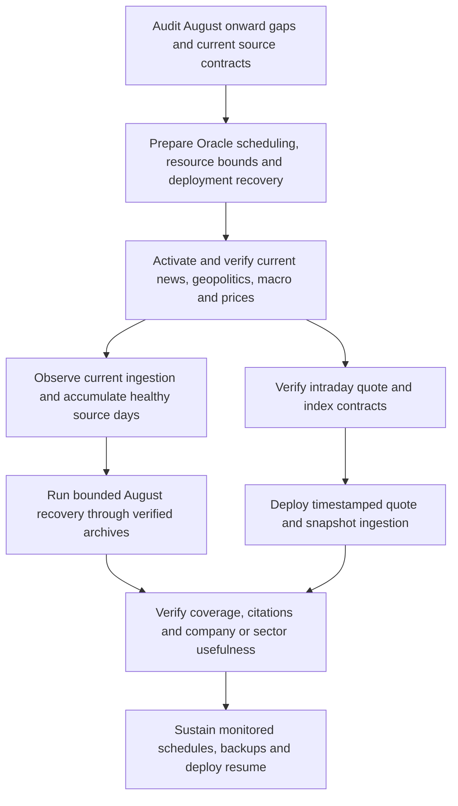

# Post–Phase 11: coverage recovery and continuous ingestion

Audit date: 2026-10-03 (Asia/Karachi). Scope: the first ordered follow-up in [the roadmap](PHASE_11_AND_FOLLOW_UP_ROADMAP.md), not Phase 11 Assistant implementation.

For precise file changes, Oracle configuration, deployment/start commands and financial extraction/index backlog sequencing, use the [October 4 activation runbook](ORACLE_INGESTION_ACTIVATION_RUNBOOK.md). It distinguishes commands supported today from prerequisite modules/settings that still need implementation, and records the freshly verified v4 extractor and report-index backlog.

## Decision

The next work is to restore current coverage and sustain it: Pakistani business/policy news, geopolitical and global-market evidence, sector drivers, structured macro observations, market prices and index/session snapshots. More PSX announcements alone will not repair the coverage gap.

Use two independently bounded lanes: ongoing current discovery and an explicit August-onward catch-up. Historical work must yield to current work. Reuse the evidence pipeline and PostgreSQL control plane; add the missing archive contracts and price contracts rather than creating another ingestion framework.

“Since August” means 2026-08-01 through the audit date. Backfill checkpoints use explicit dates; recurring live schedulers must never keep replaying that fixed historical window. This document is an execution plan. No ingestion was activated, no canonical records changed, and no deployment was performed during this audit.

## Verified Oracle baseline

Read-only SSH, aggregate database queries and bounded source checks were performed against deployed commit `1df7912538eb6e0ddfb98d8d875dafdd13de5cd4`. Counts describe stored evidence, not an exhaustive count of published articles or a guarantee of retrieval quality.

| Boundary | Observed state |
| --- | --- |
| Services | API, web, PostgreSQL, Redis, MinIO and research-worker running; no ingestion consumers or schedulers running |
| Runtime flags | `MARKET_DATA_MODE=auto`, refresh interval 300s; research ingestion, history bootstrap, macro ingestion, evidence, official breadth and reporting breadth flags all false |
| August-onward documents | 342 announcements; 40 news documents; 2 interim reports; 1 annual report |
| Monthly coverage | All 40 news documents and 342 announcements are August publications; September has one annual report and no news/announcements; no October publications in this query |
| Geographic breadth | Guardian 4, BBC 3, AP 1 news documents; Dawn 1 and Business Recorder 1; no Mettis news documents in the August-onward result |
| Current prices | 109,031 DPS price rows across history; latest trade date 2026-08-13; latest recorded market refresh was 2026-08-15 |
| Index/session snapshots | Zero `market_snapshots` rows |
| Canonical macro | 27,593 observations exist; existence does not imply current releases or adequate frequency |
| Recent source health | Many last successful discovery times are August 16; GDELT has 5 consecutive failures, IMF 56, OPEC 28 |
| Database size | 746 MB; document chunks account for 452 MB, including their indexes |
| Host storage | Root filesystem: 48 GiB, 29 GiB available; `/srv/psx`: 147 GiB, 114 GiB available; attached disks reported as 50 GiB + 150 GiB |
| Host memory | Approximately 11 GiB total, 10 GiB available; 4 GiB swap |
| Docker storage | 4.149 GB images, 8.676 GB reclaimable build cache; no evidence spool volume currently created |

The host has room for a bounded canary. This is not proof that every worker pool can run safely at its current concurrency. OCI account entitlement, other attached volume allocation, billing and backup policy were not verified; inspect those before calling this a free-tier-safe configuration. Do not assume an advertised allowance equals usable filesystem space.

### Structured macro gaps

| Series | Latest stored observation / gap | Required action |
| --- | --- | --- |
| USD/PKR, KIBOR, US 10-year yield | August 13 | Refresh missing observations and schedule current publication checks |
| Brent, Henry Hub | August 11 | Refresh daily observations; preserve release lag and source timestamp |
| Pakistan reserves | August 7 | Ingest subsequent weekly releases |
| Pakistan policy rate | Effective August 17, retrieved August 16 | Retain effective/release/retrieval distinctions; verify subsequent policy decisions rather than treating this row as current forever |
| Pakistan 3-month T-bill | April 29 | Repair auction coverage; confirm this remains an appropriate observed risk-free input |
| CPI, exports, imports, remittances | Stored series use annual observations, latest 2025 | Annual fallbacks are inadequate for timely monthly macro analysis; ingest official monthly series with distinct definitions and periods |
| Pakistan central-government debt/GDP | Latest stored date 2000 | Audit source semantics and reconciliation before use; do not simply refresh and assume it is useful |
| Pakistan net lending/GDP | No observations | Explicit missing state; implement a verified source if needed |
| Monthly commodities and US releases | Generally July periods | Refresh subsequent releases and track expected release calendars; an old period alone does not prove a provider failure |

Production metadata also needs reconciliation: `PK_REMITTANCES_USD` is stored as annual, while the current catalog declares monthly; `PK_CURRENT_ACCOUNT_USD` is absent from the queried production series. Never silently merge annual and monthly values into one comparable series. Inspect unit, frequency, release date, provider, and selection metadata before changing the catalog.

## What to ingest, in priority order

| Priority / coverage | Sources and data | August recovery | Continuous coverage |
| --- | --- | --- | --- |
| P0 Pakistan markets and policy | Dawn, Business Recorder, Mettis; SBP, Finance Ministry, PBS, SECP; NEPRA/OGRA decisions | Verify dated archives, discover missing articles/releases, retain relevant full text and citations | Existing 5-minute reporting/SBP cadence; official regulators at existing 30–60-minute cadence |
| P0 geopolitics | BBC World, Guardian World; revalidate and enable Al Jazeera; OFAC sanctions | Conflict/escalation/de-escalation, sanctions, trade restrictions, regional security, shipping-route disruption; dated archive discovery required | Existing 15-minute global reporting cadence; OFAC 30 minutes |
| P0 energy and logistics | LNG Prime, gCaptain, FreightWaves; EIA/OPEC when healthy | Oil/LNG supply developments, Red Sea/Hormuz and freight disruption, production policy | Existing 30-minute discovery cadence; source-specific circuits for failures |
| P0 structured market data | DPS daily OHLCV, separately verified intraday quotes; authoritative index/session data | Fill August–September trading-session gaps; reconcile active symbols and missing observations | Daily close reconciliation plus intraday polling only after a real quote contract passes verification |
| P0 structured macro | SBP FX/KIBOR/rates/reserves/auctions; official monthly inflation, trade, current account and remittances; Brent, gas and US yield series | Fill available observations from August; repair annual/monthly mismatch | Publication-aware refresh, not repeated whole-history hydration |
| P1 Pakistan sector drivers | Fertilizer Daily, Cotton Grower, Coal Age, Malaysian Palm Oil Council, MetalMiner/Steel Market Update | Relevant gas/fertilizer, cotton, coal, palm oil and steel developments | Existing hourly discovery cadence; prioritize applicable PSX sector exposure |
| P1 global markets/technology | CNBC, Nikkei, Federal Reserve, ECB, BIS, World Bank; EE Times, Semiconductor Engineering, Electrive | Global rates/risk, export demand, technology and supply-chain developments | Existing 15-minute global reporting / 30-minute specialist cadence |

Political coverage must retain the distinction between reported events, statements, allegations and commentary. Preserve publisher attribution and corroborating sources. Select material developments with a documented market/sector transmission channel; do not ingest every world headline or invent company exposure.

Structured commodity gaps beyond the existing catalog include current cotton, coal, palm oil and industrial-metal series, and a Pakistan-relevant LNG benchmark where obtainable. Verify contracts, benchmark geography, units and release frequency before adding them. Henry Hub is not a substitute for a Pakistan LNG import price. Monthly Pink Sheet observations must not be labeled live quotes.

### Source checks and source decisions

The expanded [37-source Oracle verification report](audits/2026-10-03-source-contracts/README.md) records discovery, article depth, dates, production PDF checks and read-only relevance scores. It supersedes the initial one-item smokes below. Source-contract verification is complete for that bounded sample; offline regression fixtures, archive contracts and sustained ingestion gates remain outstanding.

Its added company-data investigation finds 247 of 740 stored active companies without prices, all prices stale, 115 terminal partial fundamentals results, and failed historical/extraction work. A fresh Oracle check now returns HTTP 404 at DPS `/symbols`, blocking the current-price adapter before historical retrieval. Repair this discovery contract and reconcile the eligible universe before market activation; scheduler restoration alone will not fix company coverage. The report also specifies missing-market-cap contracts, deep-set coverage limits, report association issues and period-quality checks.

Initial database-free smoke checks from Oracle discovered, fetched and parsed one article each from BBC, Guardian and Al Jazeera. AP discovery returned HTTP 403. One article proves connectivity/extraction for that sample, not archive completeness, sustained reliability or market relevance.

- Keep BBC and Guardian in the first current-news canary. Al Jazeera's old DNS-failure disablement is stale: capture the working contract as a fixture, filter video/sport items and fix demonstrated metadata-gate false negatives before enabling it.
- AP's earlier successful smoke is stale too. Leave it dormant pending a working ordinary contract; do not count it as dependable current coverage.
- Reuters, Bloomberg, FT, NYT and MINING.COM remain unverified/dormant for full-text ingestion. Do not promise those publishers merely because a source entry or RSS metadata exists.
- GDELT is supplementary URL discovery, not the factual authority or the only recovery route. Revalidate a small date-bounded query under throttling limits; do not enable unrestricted retries.
- Expanded checks confirm HTTP 403 for IMF and OPEC; retain dormant states and review their circuits. NCCPL still needs a fresh contract check. Known failure counts must not disappear just because a scheduler starts.

Expanded energy/shipping checks confirm dated readable gCaptain/FreightWaves articles and explicit subscription previews from LNG Prime. Treat LNG Prime as preview-only evidence; full-text LNG coverage remains a gap. Official Pakistan adapters also need dated row/attachment association; Mettis needs timezone-conflict handling. The verification report orders these repairs before activation.

## Confirmed implementation gaps

1. **No continuous market scheduler in Oracle Compose.** `ops/ingestion run market` is one cycle. `phase2-scheduler` replenishes fundamentals/history/report queues; it does not continuously refresh current prices. Add an explicit market scheduler service and lifecycle commands.
2. **DPS current adapter is daily, not intraday.** `DpsMarketDataProvider.fetch_latest_prices` reads the date-wise `/historical` table, choosing today only after 18:00 Karachi time. A five-minute timer does not change that contract. Add a verified quote adapter with source observation timestamps and separate intraday storage if live prices are required. Keep daily OHLCV as the daily canonical series; the existing company/date uniqueness is not a tick-history schema.
3. **Snapshot ingestion is missing.** Authoritative index values, change, turnover and session status require a verified source; never synthesize an index from constituent averages. Add explicit observation time/status for intraday snapshots rather than overwriting a daily row and implying tick history.
4. **August news recovery cannot use existing presets alone.** `news_90d` allows only GDELT; the general historical unit builder supports only PSX and GDELT. RSS/listing `historical_days` is a capability declaration, not implemented date-range archive pagination. Add tested source-specific archive/API units and durable cursors.
5. **Macro scheduler cadence is not series cadence.** It wakes every 30s but uses one run key per series per UTC date. That prevents repeated successful intraday checks. Add per-series due times/publication windows and bounded incremental windows where appropriate; monthly/annual series should not be fetched every 30s.
6. **Documentation is stale around Mettis.** `docs/data-sources.md` describes a legacy daily Mettis schedule and disabled evidence polling. Current code enables its evidence SourceSpec and the legacy `run_due_ingestion_jobs` list contains SBP, SCSTrade, PBS and World Bank, not Mettis. Use one evidence polling owner and correct the docs.
7. **Continuous services are not durable across restart.** Ingestion workers and schedulers have `restart: no`; research-worker already uses `unless-stopped`. Promote only the verified continuous-ingestion services to an explicitly managed always-on mode and document reboot/start behavior.
8. **Deployment will fail once ingestion is running.** `.github/workflows/deploy-oracle.yml` deliberately refuses a deployment while ingestion services run and only restarts API/web/research-worker. Add controlled scheduler pause, worker drain/stop and exact previously enabled service restoration around deployment.
9. **Current worker/pool sizing needs bounds.** Existing Compose includes concurrency 2/4/4/1 for Phase 2, 2 for macro, and 2/4/2/1/1/1 for evidence. Multiple Python processes can each create database pools and load extraction/embedding dependencies. Give workers separate small pool limits, memory/CPU limits, bounded prefetch and log rotation; retain API headroom.
10. **Evidence presence is not company usefulness.** Current company research admits indirect evidence through only `oil_price`, `pk_policy_rate`, `usd_pkr` and saved sourced relationships. Added geopolitical/shipping stories can remain invisible to company digests. Verify Assistant topic retrieval and expose separately labeled market/sector context; expand deterministic relationships only with sourced mappings and tests. Do not attach every geopolitical story directly to every company.

Code anchors: [source catalog](../apps/api/app/ingestion/evidence_catalog.py), [historical units/presets](../apps/api/app/services/evidence_history_service.py), [macro scheduling](../apps/api/app/services/macro_schedule_service.py), [market scheduler](../apps/api/app/jobs/scheduler.py), [price adapter](../apps/api/app/services/market_providers.py), [Oracle Compose](../compose.oracle.yml), [deployment workflow](../.github/workflows/deploy-oracle.yml).

## Schedule to preserve and implement

These existing intervals are source discovery intervals, not guaranteed publication-to-answer latency. The scheduler heartbeat is separate from per-source polling. Per-source/global budgets, circuit breakers and queue delay can defer work.

| Job | Interval / release rule | State |
| --- | --- | --- |
| Evidence scheduler heartbeat | 30s | Existing; activate after verification |
| PSX announcements | 120s | Existing catalog |
| Dawn, Business Recorder, Mettis, SBP releases | 300s | Existing catalog |
| BBC, Guardian, CNBC, Nikkei; Al Jazeera after enablement | 900s | Existing catalog; source health gates apply |
| Finance Ministry, PBS, SECP, OFAC, EIA, OPEC; most specialists | 1800s | Existing catalog; OPEC currently unhealthy |
| NEPRA, OGRA, cotton/fertilizer/coal/palm/steel specialists | 3600s | Existing catalog |
| Market scheduler | Existing configured target 300s; intraday only on valid sessions, daily close reconciliation after publication | New Oracle service; adapter change required for intraday |
| Macro scheduler heartbeat | 30s | Existing; per-series scheduling repair needed |
| FX/KIBOR and daily global series | Check current release windows; initial proposal hourly when publication is expected, then a daily reconciliation | Proposed, not an existing agreed setting |
| Weekly reserves, auctions, monthly releases | Poll around published calendars with bounded daily catch-up; retain latest available observation between releases | Proposed, source calendar verification required |
| Phase 2 queue refill | Existing 2s heartbeat, report catalog refresh 6h | Preserve; queue filling is not source polling |

Do not guess trading hours or holiday calendars. Use validated exchange sessions in Asia/Karachi, bounded after-close publication retries, and source timestamps. Prices shown between sessions remain last observed quotes/close with age and session status; “live” is not a label for all stored prices.

## Ordered execution and acceptance gates



### 1. Record the gaps and bounded source contracts

Save a reproducible aggregate coverage report from August 1: source/topic/week, publication dates, successful extraction, deduplicated story counts, selected evidence, indexed documents and failures. Include active-universe price/session gaps and macro effective/release/retrieval dates. Distinguish zero discovered, rejected, duplicate, fetched-but-unindexed and truly unavailable.

Refresh source smokes from Oracle for the selected Pakistan, geopolitical, official and sector sources. Capture bounded fixtures and hashes for changed contracts; keep blocked sources disabled. Audit cheap relevance false negatives using sampled rejected geopolitical/sector headlines, not just raw discovery totals.

Gate: every proposed enabled source has a working contract or an explicit unavailable state; the August–October gap table is saved. A publisher count alone is not a completeness metric.

### 2. Prepare Oracle continuous operations before activation

Add a market scheduler service using the existing loop, initially accurately labeled daily-price refresh. Keep bulky supplemental jobs from delaying its 300s schedule: move legacy due research/weekly full-universe SCSTrade work into bounded separate scheduling/tasks. Add the intraday/index adapter and schema incrementally when its verified contract is available.

Add a curated continuous-ingestion deployment mode for market/evidence/macro and the required Phase 2 consumers. Start with discovery/fetch/parse concurrency 1–2, PDF/index 1, macro 1–2; use measured headroom to increase. These are proposed starting limits, not measured capacities. Do not bring up every historical worker at once.

Move the evidence spool to a dedicated path under `/srv/psx`, shared by workers and the scheduler, with inspected ownership and a size/retention bound. The current named volume would otherwise live under Docker's root storage. Keep immutable selected source artifacts in MinIO. Cap container logs and Celery result retention; audit database/index, Redis AOF, artifacts, spool and backups separately. Do not remove artifacts cited by retained documents.

Create/verify encrypted off-VM PostgreSQL and artifact recovery points; restore to a disposable database and verify representative object hashes. Set measured stop thresholds for both root/data filesystems and memory, reserve space for builds/backups, and inspect OCI allocation. No disk deletion or resize is part of this audit.

Update deployment: remember enabled groups, pause producers, drain consumers within a bounded grace period, preserve PostgreSQL cursors/leases, stop workers, build exact commit, run migrations, restart core, restart consumers with the new registry, then resume producers. Never purge queues to deploy. On failure leave producers paused and report the failed gate; recover to a known image/config compatible with the migrated schema. Scheduler ownership must prevent duplicate producer instances.

Gate: canary configuration validates, disposable migration tests pass for new schema, restart/reboot and drain/resume checks pass, `/api/ready` passes, resource/backup recovery thresholds are recorded.

### 3. Start current ingestion first

Enable the selected source groups consistently in the API, workers and schedulers. Current sources are chosen from working contracts; group flags alone must not enable known failures. Recreate affected containers to load the new environment and source registry. Start consumers before their producers.

Validate at least 24 hours of current prices (daily until intraday exists), reporting, geopolitical and official/sector evidence. Demonstrate a newly published item reaching selected/indexed evidence and a retrieval citation. Record source poll age, ingestion lag, queue depth/oldest age, failures and accepted/selected yield.

Retain the shared Pass 4 canary ceilings initially: 2,000 discoveries/day, 250 fetch attempts/day, 75 selections/day, 1.5 GiB raw/day, 10 GiB/trailing seven days, plus smaller per-source limits. These apply to the Pass 4 canary and are not automatically a cap on every pipeline; audit historical/PSX/Phase 2 byte growth separately. Budgets may cap coverage despite healthy polling; expose that condition. Do not scale the envelope blindly.

Gate: current data flows without monopolizing API/Assistant resources; successful polling and lack of new relevant publications are distinguishable from a stuck pipeline.

### 4. Implement and run the August recovery lane

Implement dated archive discovery for at least one reliable geopolitical publisher and the priority Pakistan sources. Guardian's documented Content API supports pagination/date filtering and requires a key; it is a candidate archive contract, not an already integrated adapter. Verify the applicable access terms, configured key and bounded responses before implementation ([documentation](https://open-platform.theguardian.com/documentation/), [access](https://open-platform.theguardian.com/access/)). BBC/Al Jazeera RSS checks prove current coverage only; separately verify any dated archive route. Do not fabricate archive URLs or historical completeness.

Extend durable historical units to the verified archive sources, with weekly date partitions, source cursors, publication date filters, URL/content deduplication, candidate/fetch/byte budgets and explicit incomplete/halted states. Recover from August 1 to the fixed catch-up cutoff; ongoing discovery continues from its own cursor. Begin with missing weeks/topics, not a repeat PSX-heavy `--preset all`. Historical breadth expansion respects the existing seven-healthy-day gate; keep current ingestion running while that evidence accumulates.

Backfill missing daily prices via the existing verified historical provider in bounded symbol batches. Refresh structured macro observations incrementally and implement missing monthly contracts. Retain provenance and revisions; do not infer numbers from news summaries. Preserve originals and index relevant narrative text; exact values remain database facts.

Gate: report coverage by source/topic/week, gaps and inaccessible archives. A capped run may end partial; never label August coverage complete because its worker exited successfully.

### 5. Validate usefulness and sustain operation

Use grounded fixtures and stored live evidence to check geopolitical, energy/shipping, Pakistan policy and sector questions. Verify dated citations, refreshed numerical facts, explicit missing-data warnings and no invented company impacts. Test each new source/scheduler critical module: due times, market closure, one active run, duplicate delivery, missed ticks, source errors, budgets, archive resume, live-before-history priority and deployment restart.

Observe a seven-day current-ingestion canary. Tune fetch budgets and worker concurrency based on extraction/unique-story/selection yield, publication-to-index delay, database growth and API latency. Alert when a scheduler exits, a source misses its due interval, a queue grows, disk/memory thresholds approach, or apparent success produces no usable observations. Backup verification and deploy pause/resume are recurring operations.

Completion requires current services to survive an ordinary reboot, a deployment to restore the intended running groups, historical recovery to have an honest coverage report, and Assistant/company research to retrieve relevant non-PSX evidence. Unavailable intraday or archive contracts remain explicit open items, not implied capabilities.

## Setup and operator commands

Run from the Oracle checkout, using `compose.oracle.yml` and existing encrypted/provider credentials. No new mock financial seeds are required. Migrations for quote/scheduler changes must be tested on a disposable database first; canonical downgrade is not a rollback plan.

```sh
# Read-only inventory / status
./ops/ingestion status
docker compose -f compose.oracle.yml exec -T api python -m app.jobs.evidence_status
docker compose -f compose.oracle.yml exec -T api python -m app.jobs.macro_status

# Contract checks: no database or queue writes
docker compose -f compose.oracle.yml exec -T api python -m app.jobs.evidence_source_smoke --group pass4_breadth --source bbc_world --source guardian_world --limit 2 --fetch

# At the verified implementation/deployment stage
docker compose -f compose.oracle.yml build api web
docker compose -f compose.oracle.yml run --rm -T api alembic upgrade head

# Existing consumer groups; producers remain a separate step
./ops/ingestion start evidence
./ops/ingestion start macro
./ops/ingestion start phase2
docker compose -f compose.oracle.yml --profile scheduling up -d evidence-scheduler macro-scheduler phase2-scheduler

# Bounded daily-price refresh, NOT an intraday feed or permanent scheduler
./ops/ingestion run market

# Health
curl --fail http://127.0.0.1:3000/api/ready
```

These start commands belong after the gates above. Add the new continuous market service and its lifecycle commands during implementation; it does not exist yet. Update `.env.oracle.example`, `ops/ingestion`, `docs/oracle-daily-operations.md` and `docs/data-sources.md` together. Enable official/breadth/macro flags only with the validated source selection, and do not print secret-bearing environment or full Compose configuration into audit logs.

Current verification limits: capacity is a point-in-time reading, not a stress test; backup restoration/OCI entitlement were not checked; exhaustive archive accessibility and topic recall were not measured. Source smokes use tiny samples. Those remaining checks are acceptance work, not facts this audit claims to have established.
